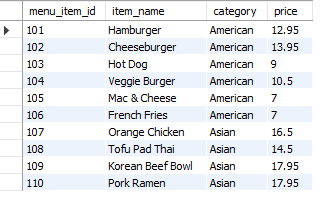
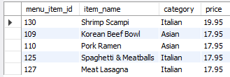
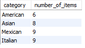
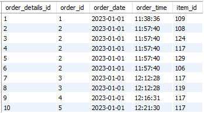
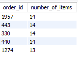
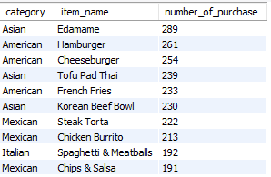
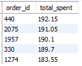
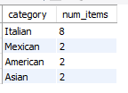

# 🍕 Restaurant Sales Analytics Project

A SQL-based analysis of restaurant order behavior, item performance, sales patterns, and category insights.  
This project uses **MySQL** for data cleaning, transformation, and analyzing raw restaurant data.

---

## 🎯 1. Objective

The goal of this project is to analyze restaurant sales data to understand:

- Menu item erformance
- Finding total orders and items sold
- Most and least ordered items  
- Category-wise performance  
- Highest spending customers  
- Sales and demand trends

---

### 📁 **menu_items Table**

| Column Name   | Description               |
|---------------|---------------------------|
| menu_item_id  | Unique ID of menu item    |
| item_name     | Name of the dish          |
| category      | Food category             |
| price         | Price of the menu item (US Dollars $)|

### 📁 **order_details Table**

| Column Name         | Description                          |
|---------------------|--------------------------------------|
| order_details_id    | Unique ID for each line item         |
| order_id            | ID of an order                        |
| order_date          | Date of order                        |
| order_time          | Time of order                        |
| item_id             | Item ordered (Matches the menu_item_id in the menu_items table) |

➡️ *(Dataset files are stored inside the `Dataset` folder.)*

---

## 🔧 3. Tools Used

- **MySQL Workbench** — Data Preparation & analysis  
- **Excel/CSV** — Source dataset  

---

## ❓ 4. Business Questions Answered

### Menu Insights  
- Which items were ordered the most & least?  
- Which categories do they belong to? 

### Orders Analysis  
- What is the date range of the dataset?  
- How many total items were ordered?  
- How many distinct orders were placed?  
- Which orders had the most number of items?  

### Sales Insights
- Who are the highest-spending customers?
- What categories contributed to those high spending orders?  

---

## 💻 5. SQL Scripts

All SQL scripts used in this project are stored in the following folder:

👉 **[Click to open SQL Scripts Folder](https://github.com/shakthi-sp/analytics-projects/tree/main/Restaurant%20Sales%20Analysis/SQL%20Scripts)**

Scripts included:

- `menu_item_analysis.sql`  
- `order_details_analysis.sql`  
- `customer_analysis_with_menu_and_order_details.sql`  

---

## 📸 Key Screenshots

### 1️⃣ Menu Items — First 10 Rows

### 2️⃣ Top 5 Most Expensive Items

### 3️⃣ Category-wise Item Count

---

### 4️⃣ Order Details — First 10 Rows

### 5️⃣ Orders with Highest Item Count

---

### 7️⃣ Most Ordered Items with Category

### 8️⃣ Top 5 Highest Spending Orders

### 9️⃣ Category Breakdown of Highest Spending Order

---

## 🔍 7. Insights & Findings

### ⭐ Key Insights

- **Asian & American dishes** dominate the most-ordered items (200+ orders each).

- Least ordered items come from Italian, Mexican, and American categories, with only 50–90 orders.

- High-value customers consistently order across **multiple categories**, not just one cuisine.

- **Large orders contain 8–15+ items,** often combining top-selling categories.

- Items priced between **$7–$14** make up most of the sales volum

## 🚀 8. Conclusion

This SQL analysis reveals clear trends in restaurant sales, including:

- Menu performance
- Customer purchase behavior  
- Category-level performance  
- High-value order characteristics 

These insights can support decisions on:

- Menu optimization
- Pricing strategy
- Promotion planning
- Inventory and forecasting 

---

## ✨ Future Enhancements

- Add Power BI dashboard  
- Add Python-based automation  
- Add advanced SQL (CTEs, window functions)  
- Add interactive visualizations 

---

